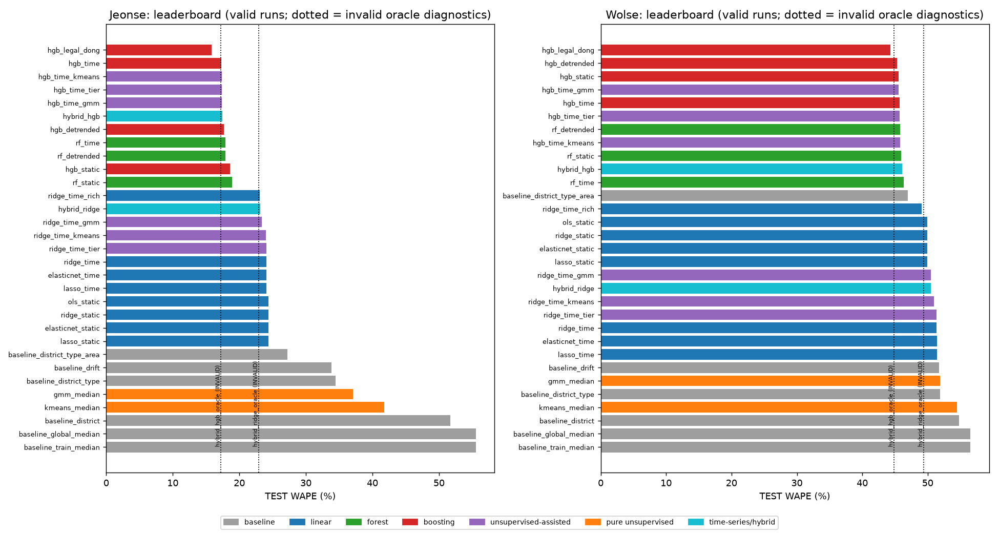
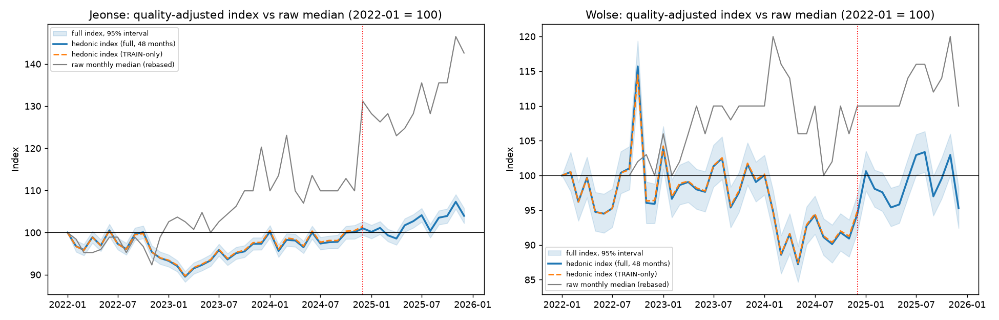
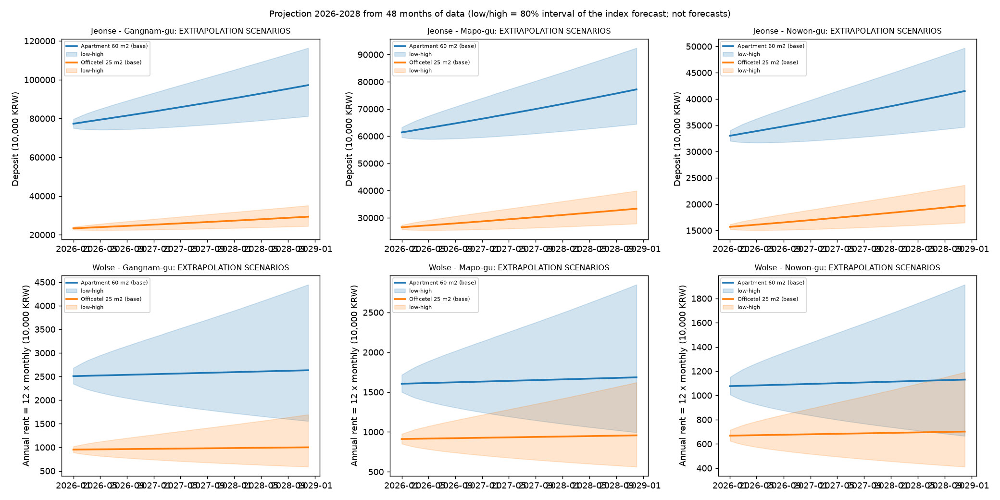

# Seoul Rental Market: How Much Will a Tenant Pay in the Coming Years?

End-to-end data science project on 387,326 cleaned Seoul rental contracts (2022-2025): leakage-safe EDA and modeling of **Jeonse** (deposit-only) and **Wolse** (monthly rent) contracts, 31 valid models compared per track (baselines, linear, forests, boosting, K-Means, hierarchical clustering, Gaussian mixtures, time series and a hybrid), a quality-adjusted price index, and clearly labelled 2026-2028 extrapolation scenarios.

## Key results

- **Best accuracy on 2025 (held-out year):** `hgb_legal_dong` in both tracks, with a WAPE of 15.84% for Jeonse and 44.33% for Wolse. It uses no time information, so it cannot extrapolate a trend.
- **Chosen model for future years** (must be able to extrapolate): `hybrid_hgb` for Jeonse (WAPE 17.44%) and `hgb_detrended` for Wolse (WAPE 45.33%). Requiring extrapolation costs 1.6094 (Jeonse) and 0.9958 (Wolse) WAPE points against the unconstrained leader.
- **Raw monthly medians mislead.** The quality-adjusted index ends 2025 at 103.96 (Jeonse) and 95.28 (Wolse), while the raw monthly median rebased to 2022-01 reaches 142.58 and 110.00: most of the apparent rise is a change in the sample mix.
- **Supervised beats unsupervised.** Boosting is the best family in both tracks; unsupervised features add little or nothing to boosting, and pure unsupervised predictors are the weakest family.
- **The 2026-2028 numbers are scenarios, not forecasts**: they extrapolate 48 months of data, and the chosen models underpredicted the 2025 level.



## Business question

How much will a tenant pay in Seoul in the coming years? The answer differs by contract type: a **Jeonse** tenant pays a large lump-sum deposit and no monthly rent, while a **Wolse** tenant pays a smaller deposit plus monthly rent. The two are modeled separately, because pooled deposits mix both types. The annual cash cost is the deposit for Jeonse and 12 x the monthly rent for Wolse.

## Data

- **Source:** Seoul Open Data Plaza, "Seoul Real Estate Jeonse and Monthly Rent Price Information" (OA-21276), file `data/Seoul_Rentals_2022_2025.csv`.
- **Sample design:** 400,000 rows x 23 columns, with about 100,000 records per year (2022-2025). It is a sample and **not proportional to the market**, so counts per month or per year are not market volume.
- **Units:** money columns are in units of 10,000 KRW (a deposit of 16,000 means 160,000,000 KRW); area is in m2.
- **Contract type:** `lease_type` is `Jeonse (deposit only)` or `Monthly rent`; it was inferred from `monthly_rent == 0` in 2022, 2024 and 2025.

**Cleaning (documented in `Notebook.ipynb`; every dropped row is counted):**

| Step | Rows dropped | Rows left |
|---|---:|---:|
| Raw file | - | 400,000 |
| Exact duplicates | 10 | |
| Missing `year_built` (12,650 missing in the raw file) | | 387,342 |
| Partial month (contracts from 2026-01-01) | 11 | 387,331 |
| Impossible `year_built` (outside 1850-2026) | 4 | 387,327 |
| Impossible `floor` (above 100; one row with floor 302) | 1 | 387,326 |

In total 12,674 rows (3.17%) were dropped and 96.83% were retained: 176,783 Jeonse and 210,543 Wolse contracts. Price and area outliers are real market values and are **kept** (log transforms are used instead); only impossible values were removed, with domain-based ranges.

## Methodology

1. **EDA** (`Notebook.ipynb`): distributions, data quality, bivariate and temporal analysis, using medians for skewed variables and separate Jeonse / Wolse comparisons.
2. **Strict temporal split.** TRAIN is 2022-01-01 to 2024-12-31 (138,848 Jeonse and 152,714 Wolse rows) and TEST is 2025 (37,935 and 57,829 rows). Never a random split. Tuning uses a 3-fold expanding-window time CV inside TRAIN.
3. **Leakage controls.** Scaling, encoding, imputation, clustering and hyperparameters are fit on TRAIN only; the deposit is never a feature of the Wolse track; `monthly_rent`, every `previous_*` column, contract dates and period columns, lot numbers and `row_id` are forbidden (enforced by tests); the target never builds cluster features.
4. **Features:** `district_name`, `building_type`, `contract_type`, `renewal_right_used`, `log_area`, `floor` (with a missing flag), `building_age`, seasonality and time index `t` only in the "time" variants, and an optional neighbourhood (`legal_dong` within district).
5. **Target:** `log1p(target)`, back-transformed with `expm1`. **Primary metric: WAPE** (also MAE, MdAPE, median and aggregate bias, RMSE and R2 on the log scale, and MAPE by district x quarter).
6. **Models compared** (notebooks `01` to `08`): naive baselines (global, district, district x type, + area quintile, last-year drift); OLS, Ridge, Lasso and Elastic Net (static and time variants, plus interactions); Random Forest (static, time, detrended); HistGradientBoosting (static, time, detrended, neighbourhood); K-Means, Ward clustering of districts and Gaussian mixtures, used as pure predictors and as features; a quality-adjusted (hedonic time-dummy) price index forecast with naive, drift, ETS, ARIMA, SARIMA and Theta; and a **hybrid** that adds a forecasted index to a structure model without time.
7. **Selection rule** (`notebook 09`): lowest WAPE; one-standard-error rule with a paired bootstrap against the leader; ties go to the simplest and least biased model; and the winner must be able to extrapolate a trend (a forecasted index, a trend added back, or a linear time feature). Trees with a time feature are flat beyond the last TRAIN month, so they cannot. Runs that use TEST information (oracle diagnostics) are excluded from every ranking.

## Results

All figures are the 2025 hold-out (33 models x 2 tracks = 66 runs; 62 valid and 4 oracle diagnostics excluded). Full table: `reports/metrics/leaderboard.csv`.

### Jeonse (target: deposit)

| Rank | Model | Family | WAPE % | Median bias % | Aggregate bias % | Handles time | Note |
|---:|---|---|---:|---:|---:|---|---|
| 1 | `hgb_legal_dong` | boosting | 15.84 | -7.37 | -8.57 | none | best accuracy, cannot extrapolate |
| 2 | `hgb_time` | boosting | 17.31 | -3.95 | -4.01 | time feature in trees (flat beyond 2024) |  |
| 3 | `hgb_time_kmeans` | unsupervised-assisted | 17.34 | -3.81 | -4.02 | time feature in trees (flat beyond 2024) |  |
| 4 | `hgb_time_tier` | unsupervised-assisted | 17.35 | -3.90 | -3.97 | time feature in trees (flat beyond 2024) |  |
| 5 | `hgb_time_gmm` | unsupervised-assisted | 17.38 | -3.90 | -4.05 | time feature in trees (flat beyond 2024) |  |
| 6 | `hybrid_hgb` | time-series/hybrid | 17.44 | -3.35 | -5.03 | forecasted index | chosen |
| 7 | `hgb_detrended` | boosting | 17.65 | 5.23 | 3.39 | log-linear trend |  |
| 8 | `rf_time` | forest | 17.91 | -5.16 | -6.46 | time feature in trees (flat beyond 2024) |  |
| 9 | `rf_detrended` | forest | 17.91 | 5.25 | 2.75 | log-linear trend |  |
| 10 | `hgb_static` | boosting | 18.59 | -7.78 | -9.36 | none |  |
| 12 | `ridge_time_rich` | linear | 23.09 | -8.26 | -10.61 | linear time feature |  |
| 24 | `baseline_district_type_area` | baseline | 27.25 | -4.76 | -10.29 | none |  |

### Wolse (target: monthly rent)

| Rank | Model | Family | WAPE % | Median bias % | Aggregate bias % | Handles time | Note |
|---:|---|---|---:|---:|---:|---|---|
| 1 | `hgb_legal_dong` | boosting | 44.33 | -16.91 | -21.67 | none | best accuracy, cannot extrapolate |
| 2 | `hgb_detrended` | boosting | 45.33 | -16.92 | -22.48 | log-linear trend | chosen |
| 3 | `hgb_static` | boosting | 45.54 | -17.65 | -23.20 | none |  |
| 4 | `hgb_time_gmm` | unsupervised-assisted | 45.56 | -18.17 | -22.30 | time feature in trees (flat beyond 2024) |  |
| 5 | `hgb_time` | boosting | 45.74 | -18.20 | -22.46 | time feature in trees (flat beyond 2024) |  |
| 6 | `hgb_time_tier` | unsupervised-assisted | 45.74 | -18.43 | -22.56 | time feature in trees (flat beyond 2024) |  |
| 7 | `rf_detrended` | forest | 45.76 | -16.19 | -23.12 | log-linear trend |  |
| 8 | `hgb_time_kmeans` | unsupervised-assisted | 45.79 | -18.35 | -22.57 | time feature in trees (flat beyond 2024) |  |
| 9 | `rf_static` | forest | 45.96 | -16.87 | -23.79 | none |  |
| 10 | `hybrid_hgb` | time-series/hybrid | 46.14 | -19.49 | -25.07 | forecasted index |  |
| 12 | `baseline_district_type_area` | baseline | 46.96 | -7.41 | -14.58 | none |  |
| 13 | `ridge_time_rich` | linear | 49.10 | -20.28 | -28.97 | linear time feature |  |

### Winner

- **Jeonse: `hybrid_hgb`**: a boosting structure model plus a forecasted quality-adjusted index. WAPE 17.44%, median bias -3.35%, aggregate bias -5.03%. It is the best model that can extrapolate; the unconstrained leader `hgb_legal_dong` has 15.84% (difference 1.6094 points, 95% bootstrap interval 1.4563 to 1.7576).
- **Wolse: `hgb_detrended`**: boosting on the detrended target with the trend added back. WAPE 45.33%, median bias -16.92%, aggregate bias -22.48%. The unconstrained leader `hgb_legal_dong` has 44.33% (difference 0.9958 points, interval 0.8129 to 1.1657).
- Within 2025 the chosen Jeonse model's median bias goes from -1.56% in Q1 to -6.59% in Q4, because its index forecast is flat while the actual level rises.

### Supervised vs unsupervised

| Family | Jeonse best model | Jeonse WAPE % | Wolse best model | Wolse WAPE % |
|---|---|---:|---|---:|
| boosting | `hgb_legal_dong` | 15.84 | `hgb_legal_dong` | 44.33 |
| unsupervised-assisted | `hgb_time_kmeans` | 17.34 | `hgb_time_gmm` | 45.56 |
| forest | `rf_time` | 17.91 | `rf_detrended` | 45.76 |
| time-series/hybrid | `hybrid_hgb` | 17.44 | `hybrid_hgb` | 46.14 |
| linear | `ridge_time_rich` | 23.09 | `ridge_time_rich` | 49.10 |
| baseline | `baseline_district_type_area` | 27.25 | `baseline_district_type_area` | 46.96 |
| pure unsupervised | `gmm_median` | 37.10 | `gmm_median` | 51.87 |

Unsupervised features added to a supervised model (change of the WAPE against the same model without them; negative is better):

| Model | vs | Jeonse WAPE change (points) | Wolse WAPE change (points) |
|---|---|---:|---:|
| `ridge_time_gmm` | `ridge_time` | -0.65 | -0.90 |
| `ridge_time_kmeans` | `ridge_time` | -0.07 | -0.38 |
| `ridge_time_tier` | `ridge_time` | -0.00 | -0.00 |
| `hgb_time_gmm` | `hgb_time` | +0.07 | -0.18 |
| `hgb_time_kmeans` | `hgb_time` | +0.03 | +0.04 |
| `hgb_time_tier` | `hgb_time` | +0.04 | +0.00 |

Supervised boosting wins. Cluster, tier and mixture features do not help boosting beyond bootstrap noise (the only gain is `hgb_time_gmm` in Wolse), help ridge a little, and pure unsupervised predictors (`kmeans_median`, `gmm_median`) are the weakest family. The unsupervised analyses are still useful to describe market segments (see notebooks `05` and `06`).

### Quality-adjusted price index

A hedonic time-dummy index (month coefficients of a regression on structural controls, rebased to 100 at 2022-01) removes the composition effect of a non-proportional sample. At 2025-12 it is 103.96 (Jeonse) and 95.28 (Wolse), against 142.58 and 110.00 for the raw median rebased. See `notebooks/07_price_index_forecasting.ipynb`.



### Scenarios 2026-2028 (extrapolation, not forecasts)

The chosen model of each track is refit on 2022-2025. The base scenario is its projection; low and high scale it by the 80% interval of the index forecast. **They extrapolate only 48 months of data and are not forecasts.** Values are in units of 10,000 KRW (1,000 = 10 million KRW); Jeonse is the deposit, Wolse is the annual rent (12 x monthly rent) while the observed median is the monthly rent. The Wolse cost excludes the deposit.

**Jeonse (deposit):**

| Profile | Observed 2025 median | Comparable contracts | 2026 base (low - high) | 2026 base vs observed % | 2028 base (low - high) |
|---|---:|---:|---:|---:|---:|
| Apartment 60 m2, Gangnam-gu | 73,000.0 | 164 | 69,726.1 (64,826.5 - 75,033.8) | -4.5 | 69,726.1 (59,099.8 - 82,270.3) |
| Apartment 60 m2, Mapo-gu | 54,117.5 | 240 | 55,047.7 (51,179.5 - 59,238.0) | 1.7 | 55,047.7 (46,658.4 - 64,951.2) |
| Apartment 60 m2, Nowon-gu | 28,000.0 | 419 | 32,733.0 (30,432.8 - 35,224.7) | 16.9 | 32,733.0 (27,744.4 - 38,622.0) |
| Officetel 25 m2, Gangnam-gu | 24,500.0 | 44 | 22,273.4 (20,708.2 - 23,968.9) | -9.1 | 22,273.4 (18,878.8 - 26,280.6) |
| Officetel 25 m2, Mapo-gu | 22,000.0 | 33 | 23,451.2 (21,803.3 - 25,236.4) | 6.6 | 23,451.2 (19,877.1 - 27,670.4) |
| Officetel 25 m2, Nowon-gu | 23,500.0 | 2 | 10,716.5 (9,963.4 - 11,532.3) | -54.4 | 10,716.5 (9,083.1 - 12,644.6) |

**Wolse (annual rent):**

| Profile | Observed 2025 median | Comparable contracts | 2026 base (low - high) | 2026 base vs observed % | 2028 base (low - high) |
|---|---:|---:|---:|---:|---:|
| Apartment 60 m2, Gangnam-gu | 200.0 | 191 | 2,291.5 (1,929.2 - 2,730.5) | -4.5 | 2,369.2 (1,485.0 - 3,780.8) |
| Apartment 60 m2, Mapo-gu | 140.0 | 159 | 1,434.0 (1,206.6 - 1,709.6) | -14.6 | 1,482.8 (927.7 - 2,369.0) |
| Apartment 60 m2, Nowon-gu | 90.0 | 268 | 940.2 (790.4 - 1,121.7) | -12.9 | 972.3 (606.8 - 1,555.9) |
| Officetel 25 m2, Gangnam-gu | 80.0 | 276 | 738.6 (620.5 - 881.7) | -23.1 | 763.9 (475.8 - 1,223.9) |
| Officetel 25 m2, Mapo-gu | 73.0 | 235 | 735.0 (617.5 - 877.4) | -16.1 | 760.2 (473.4 - 1,217.9) |
| Officetel 25 m2, Nowon-gu | 58.0 | 29 | 619.2 (519.9 - 739.5) | -11.0 | 640.5 (398.2 - 1,027.2) |

For example, the 2026 base for an Apartment of 60 m2 in Gangnam-gu is 697.3 million KRW of Jeonse deposit. The Officetel of 25 m2 in Nowon-gu in Jeonse is supported by only 2 comparable contracts in 2025 and should not be relied on.



## Limitations and what I would do differently

- **Only 48 months of data.** Trends and seasonality are barely identifiable; the 12-month index forecast errors rest on a handful of overlapping origins, and the 2026-2028 results are extrapolations whose bands are wide, in particular for Wolse.
- **A 2025 level shift no valid model anticipated.** The chosen models underpredict 2025 (aggregate bias -5.03% for Jeonse and -22.48% for Wolse), so the base scenarios are probably conservative; the Wolse base is below the observed 2025 median in every profile.
- **The sample is not proportional to the market.** Absolute volumes cannot be inferred, and the index only partly corrects composition (neighbourhood and building quality are not controlled).
- **No macro variables.** Interest rates, policy changes, supply, and price indices of the sale market would be the first additions; they are the main drivers of Jeonse deposits.
- **Trees cannot extrapolate.** The most accurate models are therefore not the ones suitable for projection; the hybrid and detrended designs are a compromise that costs accuracy.
- **Scenario bands cover only the index level.** The dispersion of individual contracts around the model (the WAPE) is not included.
- **What I would do differently:** collect more years, add macroeconomic and building-level data, model Wolse deposit and rent jointly, calibrate prediction intervals for the target year, and re-evaluate with a longer rolling-origin backtest.

## Reproducibility

- **Environment:** Python 3.13.7; packages in `requirements.txt` (`pip install -r requirements.txt`). LightGBM and SHAP are not used; scikit-learn is the only boosting implementation.
- **Random seed:** `RANDOM_SEED = 42`, defined only in `src/rent_model/config.py`.
- **Tests:** `pytest -q` (118 tests: data cleaning, splits, leakage, metrics and every model module).
- **Run everything (tests and notebooks 00 to 09, in order):** `bash scripts/run_all.sh` (or `make all`). Each notebook can also be run with `python -m nbconvert --to notebook --execute --inplace notebooks/<name>.ipynb`. The notebooks must run in order: later ones read the runs saved by earlier ones. Re-running a notebook appends a new run to `reports/metrics/{track}__{model_id}.json`; every table reads the last run. `reports/predictions/` (parquet) is generated by the notebooks and not versioned.
- **Optional app:** `pip install streamlit` and `streamlit run app/streamlit_app.py` to choose a district, building type and area and see the scenarios (it refits the chosen models locally, about a minute the first time; no network needed).
- **CI:** `.github/workflows/ci.yml` installs the requirements and runs `pytest -q` only.

## Repository map

```
Notebook.ipynb                 EDA and cleaning (English)
data/                          Seoul_Rentals_2022_2025.csv (never edited)
notebooks/
  00_modeling_setup.ipynb      protocol, temporal split, folds, smoke-test baseline
  01_baselines.ipynb           naive baselines
  02_linear_models.ipynb       OLS, Ridge, Lasso, Elastic Net
  03_random_forest.ipynb       Random Forest (static, time, detrended)
  04_gradient_boosting.ipynb   HistGradientBoosting, quantile intervals
  05_kmeans_clustering.ipynb   K-Means predictor and features
  06_hierarchical_gmm.ipynb    Ward district tiers and Gaussian mixtures
  07_price_index_forecasting.ipynb   hedonic index and its forecast
  08_hybrid_model.ipynb        structure model + forecasted index
  09_model_comparison_projection.ipynb   leaderboard, selection, 2026-2028 scenarios
src/rent_model/                config, data, features, splits, metrics, io, baselines, linear,
                               forest, boosting, clustering, unsupervised, ts_index, hybrid,
                               compare, projection
tests/                         pytest suite
reports/metrics/               one JSON per model and track, ts_index_*.json, leaderboard.csv
reports/figures/               PNG charts
app/streamlit_app.py           optional scenario explorer
scripts/run_all.sh, Makefile   run the tests and the notebooks in order
.github/workflows/ci.yml       CI (tests only)
CLAUDE.md                      project conventions and modeling protocol
```
